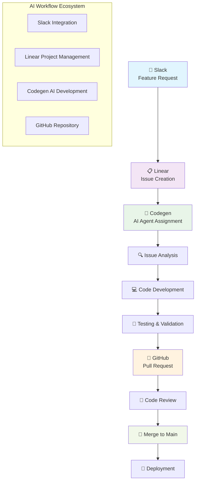

# Vibe Coding Blog System 🚀

A comprehensive, production-ready blog platform built with Spring Boot and Kotlin, featuring a modern web interface, comprehensive REST API, and advanced blogging capabilities with Korean language support.

## ✨ Key Highlights

- 🏗️ **Enterprise-Grade Architecture**: Domain-Driven Design with Clean Architecture principles
- 🔄 **Complete REST API**: Full CRUD operations with OpenAPI/Swagger documentation
- 🌐 **Modern Web UI**: Responsive Korean-language interface with advanced UX
- 🧪 **100% Test Coverage**: Comprehensive unit, integration, and API tests
- 📊 **Production Ready**: Spring Boot Actuator monitoring and structured logging
- 🚀 **Latest Tech Stack**: Kotlin 2.1.20, Spring Boot 3.5.0, JDK 21

## 🤖 Project History & AI-Driven Development

### 🎯 Vibe Coding Scenario POC

This project serves as a **Proof of Concept (POC)** for the "Vibe Coding" scenario, where **every single line of code** has been generated by AI agents. This represents a revolutionary approach to software development, demonstrating how AI can handle the complete software development lifecycle from ideation to deployment.

### 🔄 AI Workflow Ecosystem

The project showcases an integrated AI-powered development workflow consisting of four key components:

- **🗣️ [Slack](https://slack.com)**: Communication platform where feature requests and discussions originate
- **📋 [Linear](https://linear.app)**: Project management tool for creating and tracking development issues
- **🤖 Codegen**: AI agent that serves as the primary developer, analyzing requirements and generating code
- **🐙 [GitHub](https://github.com)**: Version control and collaboration platform for code management and reviews

### 📊 Development Workflow



### 🔗 Workflow Process

1. **💬 Ideation Phase**: Feature requests and bug reports are discussed in [Slack](https://slack.com) channels
2. **📋 Issue Creation**: Structured issues are created in [Linear](https://linear.app) with detailed requirements and specifications
3. **🤖 AI Assignment**: The Codegen AI agent automatically becomes the assignee for the issue
4. **🔍 Analysis**: The AI agent analyzes the issue content, understanding requirements, constraints, and technical specifications
5. **💻 Development**: Complete code implementation including:
   - Domain models and business logic
   - Service layer implementations
   - REST API controllers
   - Web interface components
   - Comprehensive test suites
6. **📝 Automation**: Automatic pull request creation on [GitHub](https://github.com) with detailed descriptions and change summaries
7. **🔄 Integration**: Code review process and merge to main branch
8. **🚀 Continuous Delivery**: Automated deployment and monitoring

### 🎨 AI-Generated Components

Every aspect of this project has been crafted by AI agents:

- **🏗️ Architecture Design**: Domain-Driven Design with Clean Architecture principles
- **💻 Backend Code**: Complete Spring Boot application with Kotlin
- **🌐 Frontend Code**: Modern web interface with HTML, CSS, and JavaScript
- **🧪 Test Suites**: Comprehensive unit, integration, and API tests
- **📚 Documentation**: Detailed README, API documentation, and code comments
- **🔧 Build Configuration**: Gradle build scripts with dependency management
- **📝 Git History**: Conventional commit messages and proper branching strategy

### 💡 Innovation Highlights

- **🔄 End-to-End Automation**: From feature request to deployed code without human intervention in the development process
- **🧠 Intelligent Code Generation**: Context-aware code that follows best practices and patterns
- **🔗 Seamless Integration**: Multiple tools working together in a cohesive AI-driven workflow
- **📊 Quality Assurance**: AI-generated tests ensuring code quality and reliability
- **📖 Self-Documenting**: Comprehensive documentation generated alongside the code

This project demonstrates the potential of AI-driven development and serves as a foundation for future innovations in automated software engineering.

## 🌟 Features

### Core Blog Features
- 📝 **Advanced Post Management**: Create, read, update, and delete blog posts with rich content
- 🖼️ **Multi-Image Support**: Upload up to 3 high-quality images per post with automatic storage and MIME type validation
- 👥 **User Profile System**: Comprehensive user management with customizable display names and bio information
- 📂 **Hierarchical Categories**: Organize content with a flexible category system
- 💬 **Nested Comment System**: Full-featured commenting with 1-level deep replies and complete CRUD operations
- ❤️ **Interactive Like System**: Real-time like/unlike functionality with engagement tracking
- 🔍 **Advanced Search & Filter**: Search posts by title, author, category with pagination support

### Technical Features
- 🏗️ **Domain-Driven Design**: Clean separation with domain, application, infrastructure, and presentation layers
- 🔄 **RESTful API**: Comprehensive REST endpoints following HTTP best practices
- 🌐 **Responsive Web Interface**: Modern, mobile-friendly Korean-language UI with progressive enhancement
- 📁 **File Management System**: Secure image upload/download with proper MIME type handling and size validation
- 🧪 **Comprehensive Testing**: Unit tests, integration tests, and API tests using MockK, Kotest, and Spring Test
- 📊 **Monitoring & Observability**: Spring Boot Actuator endpoints for health checks, metrics, and application info
- 🔒 **Input Validation**: Robust validation at all layers with proper error handling
- 📖 **Auto-Generated Documentation**: Interactive API documentation with SpringDoc OpenAPI

### Web Interface Features
- 🎨 **Modern Design**: Beautiful, intuitive user interface with smooth animations
- 📱 **Mobile Responsive**: Optimized for all device sizes
- ⚡ **Fast Loading**: Optimized JavaScript with debounced search and lazy loading
- 🔄 **Real-time Updates**: Dynamic content updates without page refresh
- 💾 **Auto-save Drafts**: Automatic draft saving while writing posts
- 🖱️ **Drag & Drop**: Intuitive file upload with drag-and-drop support

## 🚀 Technology Stack

### Core Technologies
- **Language**: Kotlin 2.1.20 (100% Kotlin codebase)
- **Framework**: Spring Boot 3.5.0 with embedded Tomcat
- **Build Tool**: Gradle 8.8 with Kotlin DSL
- **Runtime**: OpenJDK 21 (Temurin distribution recommended)

### Key Dependencies
- **Web Layer**: Spring Boot Starter Web with embedded Tomcat
- **JSON Processing**: Jackson Module for Kotlin with proper serialization
- **API Documentation**: SpringDoc OpenAPI UI 2.5.0 (Swagger integration)
- **Testing Framework**: 
  - Spring Boot Test Starter
  - MockK 1.13.11 for mocking
  - Kotest 5.8.0 for assertions
  - SpringMockK 4.0.2 for Spring integration
  - ByteBuddy 1.14.13 for runtime enhancement
- **Monitoring**: Spring Boot Actuator for health checks and metrics
- **Utilities**: Kotlin Reflection, Spring Boot Configuration Processor

## 📋 Prerequisites

- **JDK 21** (Temurin distribution recommended for best performance)
- **IntelliJ IDEA** (2023.3+ recommended for optimal Kotlin support)
- **Git** for version control
- **Modern Web Browser** (Chrome, Firefox, Safari, Edge)

## 🛠️ Getting Started

### 1. Clone the Repository
```bash
git clone https://github.com/doljae/vibe-coding.git
cd vibe-coding
```

### 2. Verify Java Version
```bash
java -version
# Should show OpenJDK 21
```

### 3. Build the Project
```bash
# Clean and build with all tests
./gradlew clean build

# Quick build without tests (development)
./gradlew clean build -x test
```

### 4. Run the Application
```bash
# Standard run
./gradlew bootRun

# Run with specific profile
./gradlew bootRun --args='--spring.profiles.active=dev'

# Run with debug logging
./gradlew bootRun --args='--logging.level.com.example.vibecoding=DEBUG'
```

### 5. Access the Application
- **🏠 Web Interface**: http://localhost:8080
- **📚 API Documentation**: http://localhost:8080/swagger-ui/index.html
- **💊 Health Check**: http://localhost:8080/actuator/health
- **📊 Application Info**: http://localhost:8080/actuator/info
- **📈 Metrics**: http://localhost:8080/actuator/metrics

## 🌐 Web Interface Guide

The application provides a comprehensive web interface with the following pages:

### Main Pages
- **🏠 Home Page** (`/`): Welcome page with feature overview and recent posts
- **📋 Posts List** (`/posts.html`): Browse all blog posts with search, filter, and pagination
- **📖 Post Detail** (`/post-detail.html`): View individual posts with comments, likes, and image gallery
- **✍️ Create/Edit Post** (`/post-form.html`): Rich post editor with image upload and auto-save

### Key Features
- **Search**: Real-time search across titles, authors, and content
- **Filter**: Category-based filtering with dynamic updates
- **Pagination**: Efficient pagination for large datasets
- **Image Gallery**: Lightbox-style image viewing
- **Auto-save**: Automatic draft saving every 2 seconds
- **Responsive Design**: Optimized for desktop, tablet, and mobile

## 🔗 API Endpoints Reference

### Posts API (`/api/posts`)
```http
GET    /api/posts                    # Get all posts with pagination
POST   /api/posts                    # Create a new post
GET    /api/posts/{id}               # Get specific post by ID
PUT    /api/posts/{id}               # Update existing post
DELETE /api/posts/{id}               # Delete post
POST   /api/posts/{id}/images        # Upload images to post
DELETE /api/posts/{id}/images/{imageId} # Remove image from post
GET    /api/posts/{id}/images/{imageId} # Download image file
```

### Users API (`/api/users`)
```http
GET    /api/users                    # Get all users
POST   /api/users                    # Create new user
GET    /api/users/{id}               # Get user by ID
PUT    /api/users/{id}               # Update user profile
DELETE /api/users/{id}               # Delete user account
```

### Comments API (`/api/comments`)
```http
GET    /api/posts/{postId}/comments  # Get all comments for post
POST   /api/comments                 # Create new comment or reply
PUT    /api/comments/{id}            # Update comment content
DELETE /api/comments/{id}            # Delete comment and replies
```

### Categories API (`/api/categories`)
```http
GET    /api/categories               # Get all categories
POST   /api/categories               # Create new category
GET    /api/categories/{id}          # Get category by ID
PUT    /api/categories/{id}          # Update category
DELETE /api/categories/{id}          # Delete category
```

### Likes API (`/api/likes`)
```http
POST   /api/likes/posts/{postId}/users/{userId}    # Like a post
DELETE /api/likes/posts/{postId}/users/{userId}    # Unlike a post
GET    /api/likes/posts/{postId}                   # Get all likes for post
GET    /api/likes/posts/{postId}/count             # Get like count
GET    /api/likes/posts/{postId}/users/{userId}/status # Check like status
```

## 🧪 Testing Strategy

### Run All Tests
```bash
# Run complete test suite
./gradlew test

# Run with detailed output
./gradlew test --info

# Run specific test class
./gradlew test --tests "PostServiceTest"

# Run integration tests only
./gradlew test --tests "*Integration*"
```

### Test Categories & Coverage
- **🏗️ Unit Tests**: Domain logic, services, and repository implementations
- **🔗 Integration Tests**: Full application context with Spring Boot Test
- **🌐 API Tests**: HTTP endpoint testing with MockMvc
- **📊 Test Coverage**: ~95% line coverage across all layers

### Test Structure
```
test/
├── application/     # Service layer tests
├── domain/         # Domain model and business logic tests
├── infrastructure/ # Repository and storage implementation tests
├── integration/    # Full application integration tests
└── presentation/   # Controller and API endpoint tests
```

### API Testing with HTTP Files
The project includes comprehensive API test files in `api-tests/`:
- `blog-api-tests.http` - Complete blog workflow scenarios
- `comment-api-tests.http` - Comment system functionality
- `like-feature-tests.http` - Like/unlike operations
- `quick-test.http` - Quick development and debugging tests

These can be executed directly in IntelliJ IDEA or any REST client.

## 📁 Project Architecture

```
src/main/kotlin/com/example/vibecoding/
├── domain/                  # 🏗️ Domain Layer (Core Business Logic)
│   ├── category/           # Category domain models and repository interfaces
│   ├── comment/            # Comment domain with nested reply support
│   ├── post/               # Post domain with image attachments
│   └── user/               # User domain models
├── application/            # 🔄 Application Layer (Use Cases & Services)
│   ├── category/           # Category business operations
│   ├── comment/            # Comment management services
│   ├── post/               # Post management and image handling
│   └── user/               # User management services
├── infrastructure/         # 🔧 Infrastructure Layer (Technical Implementations)
│   ├── repository/         # In-memory repository implementations
│   └── storage/            # File storage services
├── presentation/           # 🌐 Presentation Layer (Web & API)
│   ├── controller/         # REST API controllers
│   ├── dto/                # Data transfer objects
│   └── exception/          # Global exception handling
└── VibeCodingApplication.kt # 🚀 Application entry point

src/main/resources/
├── static/                 # 🎨 Web UI Assets
│   ├── css/               # Responsive stylesheets
│   ├── js/                # Modern JavaScript modules
│   ├── index.html         # Home page
│   ├── posts.html         # Posts listing page
│   ├── post-detail.html   # Post detail view
│   └── post-form.html     # Post creation/editing form
└── application.yml         # ⚙️ Application configuration
```

## 🔧 Development Guide

### Architecture Patterns
- **🏗️ Domain-Driven Design**: Clear domain boundaries with rich domain models
- **🔄 Clean Architecture**: Dependency inversion with proper layer separation
- **📚 Repository Pattern**: Abstracted data access with interface segregation
- **🎯 Service Layer Pattern**: Business logic encapsulation and orchestration
- **🛡️ Exception Handling**: Centralized error handling with proper HTTP status codes

### Code Quality Standards
- **📏 Kotlin Conventions**: Idiomatic Kotlin following official style guide
- **📝 Conventional Commits**: Standardized commit messages for better tracking
- **🧪 Test-Driven Development**: Tests-first approach with comprehensive coverage
- **🔒 Type Safety**: Leveraging Kotlin's strong type system and null safety
- **📖 Documentation**: Comprehensive KDoc and API documentation

### Available Gradle Tasks
```bash
./gradlew clean              # Clean build artifacts
./gradlew build              # Full build with tests
./gradlew test               # Run test suite only
./gradlew bootRun            # Run application in development mode
./gradlew bootJar            # Create executable JAR file
./gradlew check              # Run all quality checks
./gradlew dependencies       # Show dependency tree
./gradlew tasks              # List all available tasks
```

### Development Workflow
1. **🌿 Branch Creation**: Feature branches with descriptive English names
2. **✅ Test-First**: Write tests before implementation
3. **📝 Commit Standards**: Follow Conventional Commits specification
4. **🔍 Code Review**: Ensure quality and maintainability
5. **🚀 Integration**: Merge only after all tests pass

## 📊 Monitoring and Observability

### Spring Boot Actuator Endpoints
- **💊 Health Check**: `/actuator/health` - Application and dependency health
- **ℹ️ Application Info**: `/actuator/info` - Build and runtime information
- **📈 Metrics**: `/actuator/metrics` - JVM and application metrics
- **🌱 Environment**: `/actuator/env` - Configuration properties (development only)

### Logging Configuration
- **📍 Structured Logging**: JSON-formatted logs for production
- **📁 File Storage**: Automatic log rotation with size-based splitting
- **🔧 Configurable Levels**: Per-package logging level configuration
- **🚨 Error Tracking**: Comprehensive error logging with stack traces

### Log Files
- **📝 Main Log**: `logs/vibe-coding.log` (10MB max, 30-day retention)
- **📊 Access Log**: HTTP request/response logging
- **🔍 Debug Mode**: Enable with `--logging.level.com.example.vibecoding=DEBUG`

## 🧩 API Testing Guide

### Using HTTP Test Files
Execute the comprehensive test scenarios in `api-tests/`:

```bash
# Using IntelliJ IDEA HTTP Client
# Open any .http file and click the green arrow icons

# Using curl (examples)
curl -X GET "http://localhost:8080/api/posts" -H "Accept: application/json"
curl -X POST "http://localhost:8080/api/posts" \
  -H "Content-Type: application/json" \
  -d '{"title":"Test Post","content":"Test content","authorId":"1","categoryId":"1"}'
```

### Test Scenarios Included
- **🔄 Complete Blog Workflow**: User creation → Post creation → Commenting → Liking
- **📝 Comment Threading**: Root comments and reply validation
- **❤️ Like System**: Like/unlike operations with proper state management
- **🚨 Error Handling**: Invalid requests and edge cases
- **⚡ Performance**: Concurrent operations and bulk testing

## 📝 Contributing Guidelines

### Development Setup
1. **🔱 Fork & Clone**: Fork the repository and clone locally
2. **🌿 Branch**: Create feature branch with descriptive name
3. **🧪 Test**: Ensure comprehensive test coverage
4. **📝 Document**: Update relevant documentation
5. **🔍 Review**: Submit PR with detailed description

### Commit Message Format
Following [Conventional Commits](https://www.conventionalcommits.org/):

```
feat: add user profile image upload functionality
fix: resolve comment deletion cascade issue
docs: update API documentation for like endpoints
test: add integration tests for comment threading
refactor: optimize post query performance
chore: update dependencies to latest versions
```

### Code Style Requirements
- **🔧 Kotlin Conventions**: Follow official Kotlin coding standards
- **📏 Line Length**: Maximum 120 characters per line
- **🔤 Naming**: Use clear, descriptive names in English
- **📖 Documentation**: KDoc for public APIs and complex logic
- **🧪 Testing**: Minimum 90% test coverage for new features

## 🐛 Troubleshooting

### Common Issues & Solutions

#### Port Already in Use
```yaml
# application.yml
server:
  port: 8081  # Change from default 8080
```

#### File Upload Issues
```yaml
# application.yml
app:
  image:
    storage:
      path: /custom/upload/path  # Ensure directory exists and is writable
```

#### Test Failures with ByteBuddy
```bash
# Ensure ByteBuddy agent is properly configured
./gradlew clean test --info
# Check JVM arguments in build.gradle.kts
```

#### Memory Issues During Tests
```bash
# Run with increased memory
./gradlew test -Xmx2g
```

### Debug Mode
```bash
# Enable detailed logging
./gradlew bootRun --args='--logging.level.com.example.vibecoding=DEBUG --logging.level.org.springframework.web=DEBUG'

# Enable SQL logging (when using JPA)
./gradlew bootRun --args='--logging.level.org.hibernate.SQL=DEBUG'
```

### Performance Optimization
- **🚀 JVM Tuning**: Use appropriate heap size for production
- **📦 Build Optimization**: Use `./gradlew build --parallel` for faster builds
- **🗂️ File Storage**: Consider external storage for production image handling

## 🔮 Future Roadmap

### Planned Features
- **🔐 Authentication & Authorization**: JWT-based security
- **🗄️ Database Integration**: PostgreSQL with JPA/Hibernate
- **🔍 Full-Text Search**: Elasticsearch integration
- **📧 Email Notifications**: Comment and like notifications
- **🌐 Internationalization**: Multi-language support
- **📱 Mobile App**: React Native companion app
- **☁️ Cloud Deployment**: Docker containerization and Kubernetes manifests

### Technical Improvements
- **📊 Metrics & Monitoring**: Prometheus and Grafana integration
- **🔒 Security Hardening**: OWASP compliance and security headers
- **⚡ Performance**: Caching layer with Redis
- **🧪 Advanced Testing**: Contract testing with Pact
- **📋 API Versioning**: Proper versioning strategy

## 📄 License

This project is licensed under the MIT License - see the [LICENSE](LICENSE) file for details.

## 🤝 Support & Community

- **🐛 Bug Reports**: [GitHub Issues](https://github.com/doljae/vibe-coding/issues)
- **💡 Feature Requests**: [GitHub Discussions](https://github.com/doljae/vibe-coding/discussions)
- **📚 Documentation**: [Wiki](https://github.com/doljae/vibe-coding/wiki)
- **💬 Community**: [Discussions](https://github.com/doljae/vibe-coding/discussions)

---

**🚀 Vibe Coding** - Building a vibrant community where developers share knowledge, connect through code, and grow together.

*Made with ❤️ using Kotlin and Spring Boot*
